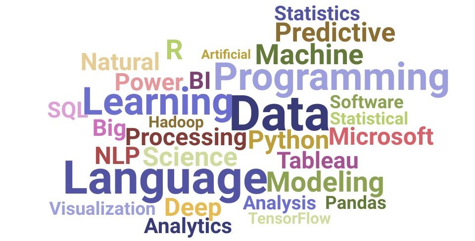
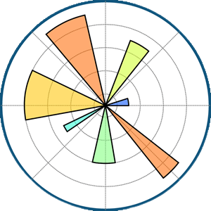

<!--**SadeTosin/SadeTosin** is a ✨ _special_ ✨ repository because its `README.md` (this file) appears on your GitHub profile.-->

<h2 align="left">Hi there ! 👋 My name is Folasade Oluwatosin - Data Science | Engineering </h2> 
 

<h3 align="left">Data Enthusiast  |  Passionate about Tech  |  Creative Problem Solver </h3> 
I am a certified computer scientist and data professional with a strong passion for working with data.🔭  Currently, I am exploring data engineering and continuously expanding my knowledge in the field. I possess solid coding and problem-solving skills and have hands-on experience with the latest technologies. I am motivated by the desire to achieve success and thrive in challenging environments. Additionally, I am a continuous learner and have good knowledge of data science and machine learning. One interesting fact about me is that I love pets, especially dogs.⚡ My career objective is to contribute to a progressive organization, utilizing my technical and creative skills to drive growth while staying up-to-date with emerging trends in the IT sector.🌟 Join me in collaborating on thrilling data-driven projects! Let's connect and work together!
 
 

<!--  <h3>Connect :</h3> -->

 

 
### Languages and Tools:

 
 

 
